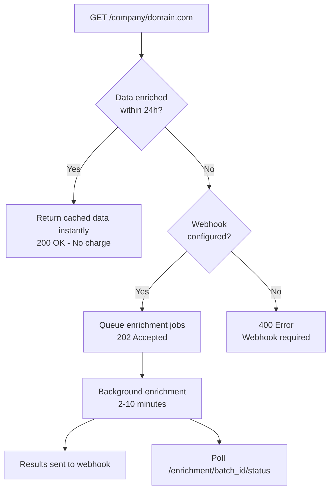

## Overview

The Company API is the primary endpoint for fetching company data. Send a domain and get enriched data — it's that simple.

<Info>
  **How it works:** The API automatically handles everything. If data exists from the last 24 hours, you get it instantly. Otherwise, a fresh enrichment is triggered and results are delivered via webhook.
</Info>

<Warning>
  **Webhook required:** All new enrichment requests require a webhook URL. Configure it in your [API Panel](https://bouncewatch.com/api-panel/webhooks) or send it via the `X-Webhook-URL` header. For quick testing, get a free URL from [webhook.site](https://webhook.site).
</Warning>

## Endpoint

<ParamField path="domain" type="string" required>
  Company domain (e.g., `stripe.com`, `openai.com`)
</ParamField>

```
GET /api/v1/company/{domain}
```

## Parameters

<ParamField query="enrich" type="string">
  Comma-separated list of enrichment modules to include.
  
  Available modules: `business`, `technology`, `funding`, `team`, `signals`, `competitors`
</ParamField>

## How It Works



### Scenario 1: Recent Data Available (Instant Response)

If the same domain was enriched within the last 24 hours, you get the data instantly at **no additional cost**:

```json
{
  "success": true,
  "data": {
    "company": { ... },
    "funding": { ... }
  },
  "credits_used": 0,
  "from_recent_enrichment": true,
  "credits_remaining": 4500,
  "webhook_hint": "To enrich new domains, configure a webhook URL..."
}
```

### Scenario 2: Fresh Enrichment (Async Response)

If no recent data exists, enrichment is triggered automatically:

```json
{
  "success": true,
  "status": "processing",
  "batch_id": "batch_1gVwXby8PsYHoMQR",
  "current_data": { ... },
  "enrichment_status": "processing",
  "modules_requested": ["business", "funding"],
  "modules_count": 2,
  "webhook_notification": "enabled",
  "status_endpoint": "https://api.bouncewatch.com/api/v1/enrichment/batch_1gVwXby8PsYHoMQR/status",
  "results_endpoint": "https://api.bouncewatch.com/api/v1/enrichment/batch_1gVwXby8PsYHoMQR/results",
  "credits_reserved": 20,
  "message": "Enrichment jobs queued successfully. Fresh data will be sent to your webhook when ready.",
  "hint": "Results will be delivered to your webhook URL. You can also poll the status_endpoint to check progress."
}
```

## Request Examples

<Tabs>
  <Tab title="Base Data Only">
    Get basic company information (10 credits):
    
    <CodeGroup>
    ```bash cURL
    curl -X GET "https://api.bouncewatch.com/api/v1/company/stripe.com" \
      -H "X-API-Key: YOUR_API_KEY" \
      -H "X-Webhook-URL: https://your-server.com/webhook"
    ```
    
    ```javascript JavaScript
    const response = await fetch(
      'https://api.bouncewatch.com/api/v1/company/stripe.com',
      { headers: { 
        'X-API-Key': 'YOUR_API_KEY',
        'X-Webhook-URL': 'https://your-server.com/webhook'
      }}
    );
    const data = await response.json();

    if (response.status === 200) {
      // Instant data (from 24h cache)
      console.log(data.data.company);
    } else if (response.status === 202) {
      // Enrichment queued - wait for webhook
      console.log(`Batch: ${data.batch_id}`);
    }
    ```
    
    ```python Python
    import requests

    response = requests.get(
        'https://api.bouncewatch.com/api/v1/company/stripe.com',
        headers={
            'X-API-Key': 'YOUR_API_KEY',
            'X-Webhook-URL': 'https://your-server.com/webhook'
        }
    )
    data = response.json()

    if response.status_code == 200:
        # Instant data (from 24h cache)
        print(data['data']['company'])
    elif response.status_code == 202:
        # Enrichment queued
        print(f"Batch: {data['batch_id']}")
    ```

    ```php PHP
    $ch = curl_init('https://api.bouncewatch.com/api/v1/company/stripe.com');
    curl_setopt($ch, CURLOPT_RETURNTRANSFER, true);
    curl_setopt($ch, CURLOPT_HTTPHEADER, [
        'X-API-Key: YOUR_API_KEY',
        'X-Webhook-URL: https://your-server.com/webhook'
    ]);
    $response = curl_exec($ch);
    $httpCode = curl_getinfo($ch, CURLINFO_HTTP_CODE);
    $data = json_decode($response, true);

    if ($httpCode === 200) {
        // Instant data (from 24h cache)
        print_r($data['data']['company']);
    } elseif ($httpCode === 202) {
        // Enrichment queued
        echo "Batch: " . $data['batch_id'];
    }
    ```
    </CodeGroup>
  </Tab>
  
  <Tab title="With Enrichments">
    Add funding and team data (26 credits):
    
    <CodeGroup>
    ```bash cURL
    curl -X GET "https://api.bouncewatch.com/api/v1/company/stripe.com?enrich=funding,team" \
      -H "X-API-Key: YOUR_API_KEY" \
      -H "X-Webhook-URL: https://your-server.com/webhook"
    ```
    
    ```javascript JavaScript
    const response = await fetch(
      'https://api.bouncewatch.com/api/v1/company/stripe.com?enrich=funding,team',
      { headers: { 
        'X-API-Key': 'YOUR_API_KEY',
        'X-Webhook-URL': 'https://your-server.com/webhook'
      }}
    );
    ```
    
    ```python Python
    response = requests.get(
        'https://api.bouncewatch.com/api/v1/company/stripe.com',
        headers={
            'X-API-Key': 'YOUR_API_KEY',
            'X-Webhook-URL': 'https://your-server.com/webhook'
        },
        params={'enrich': 'funding,team'}
    )
    ```

    ```php PHP
    $ch = curl_init('https://api.bouncewatch.com/api/v1/company/stripe.com?enrich=funding,team');
    curl_setopt($ch, CURLOPT_RETURNTRANSFER, true);
    curl_setopt($ch, CURLOPT_HTTPHEADER, [
        'X-API-Key: YOUR_API_KEY',
        'X-Webhook-URL: https://your-server.com/webhook'
    ]);
    $response = curl_exec($ch);
    $data = json_decode($response, true);
    ```
    </CodeGroup>
  </Tab>
  
  <Tab title="Full Profile">
    Get all available data (60 credits):
    
    <CodeGroup>
    ```bash cURL
    curl -X GET "https://api.bouncewatch.com/api/v1/company/stripe.com?enrich=business,technology,funding,team,signals,competitors" \
      -H "X-API-Key: YOUR_API_KEY" \
      -H "X-Webhook-URL: https://your-server.com/webhook"
    ```
    
    ```javascript JavaScript
    const modules = ['business', 'technology', 'funding', 'team', 'signals', 'competitors'];
    const response = await fetch(
      `https://api.bouncewatch.com/api/v1/company/stripe.com?enrich=${modules.join(',')}`,
      { headers: { 
        'X-API-Key': 'YOUR_API_KEY',
        'X-Webhook-URL': 'https://your-server.com/webhook'
      }}
    );
    ```
    
    ```python Python
    response = requests.get(
        'https://api.bouncewatch.com/api/v1/company/stripe.com',
        headers={
            'X-API-Key': 'YOUR_API_KEY',
            'X-Webhook-URL': 'https://your-server.com/webhook'
        },
        params={'enrich': 'business,technology,funding,team,signals,competitors'}
    )
    ```

    ```php PHP
    $modules = ['business', 'technology', 'funding', 'team', 'signals', 'competitors'];
    $url = 'https://api.bouncewatch.com/api/v1/company/stripe.com?enrich=' . implode(',', $modules);
    $ch = curl_init($url);
    curl_setopt($ch, CURLOPT_RETURNTRANSFER, true);
    curl_setopt($ch, CURLOPT_HTTPHEADER, [
        'X-API-Key: YOUR_API_KEY',
        'X-Webhook-URL: https://your-server.com/webhook'
    ]);
    $response = curl_exec($ch);
    $data = json_decode($response, true);
    ```
    </CodeGroup>
  </Tab>
</Tabs>

## Webhook Setup

<Note>
  **Quick testing tip:** Don't have a webhook endpoint yet? Go to [webhook.site](https://webhook.site) and copy your unique URL. Use it as the `X-Webhook-URL` header value to see enrichment results instantly.
</Note>

You can set your webhook URL in two ways:
1. **Per-request:** Add `X-Webhook-URL` header to your request
2. **Permanently:** Configure it in your [API Panel → Webhooks](https://bouncewatch.com/api-panel/webhooks)

When enrichment completes, we POST to your webhook with full results:

```json
{
  "event": "enrichment.completed",
  "batch_id": "batch_1gVwXby8PsYHoMQR",
  "domain": "stripe.com",
  "status": "completed",
  "requested_modules": ["business", "funding"],
  "requested_at": "2025-11-23T10:00:00Z",
  "completed_at": "2025-11-23T10:05:30Z",
  "duration_seconds": 330,
  "credits": {
    "reserved": 26,
    "used": 26,
    "refunded": 0
  },
  "data_url": "https://api.bouncewatch.com/api/v1/enrichment/batch_1gVwXby8PsYHoMQR/results",
  "_meta": {
    "api_version": "2.0",
    "webhook_attempt": 1
  }
}
```

<Warning>
  The webhook payload does not contain enrichment data directly. Use the `data_url` with your API key to fetch the full results.
</Warning>

## 24-Hour Smart Cache

When you query a domain that was enriched within the last 24 hours:

- **Response:** Instant (200 OK, < 250ms) 
- **Cost:** Free (0 credits)
- **Webhook:** Not required

This means your typical workflow is:
1. **First request:** Enrichment triggers (202), webhook delivers results
2. **Subsequent requests within 24h:** Instant data at no cost

<Tip>
  This replaces the old "cached mode" — you don't need any special parameters. The API automatically serves cached data when available.
</Tip>

## Credit Costs

| Module | Credits | What's Included? |
|--------|---------|------------------|
| Base (always) | 10 | Company info, location, social, legal |
| `business` | +6 | Industry, business model, target market |
| `technology` | +4 | Tech stack, 100+ technologies |
| `funding` | +10 | Funding rounds, investors, valuations |
| `team` | +6 | Team members, hiring status |
| `signals` | +16 | 40 signal types, highlights |
| `competitors` | +8 | Competitors, similar companies |

## Processing Times

| Modules Requested | Estimated Time |
|-------------------|----------------|
| Base only | 1-2 minutes |
| 1-2 modules | 3-5 minutes |
| 3-4 modules | 5-8 minutes |
| All modules | 8-12 minutes |

<Tip>
  Processing times depend on data availability. Companies with more online presence are typically faster to enrich.
</Tip>

<Card title="Track Enrichment Progress" icon="chart-bar" href="/api-reference/enrichment-tracking">
  Monitor batch status and retrieve results →
</Card>
<Card title="Complete Response Reference" icon="sitemap" href="/api-reference/response-schema">
  See all response fields and their types in detail →
</Card>