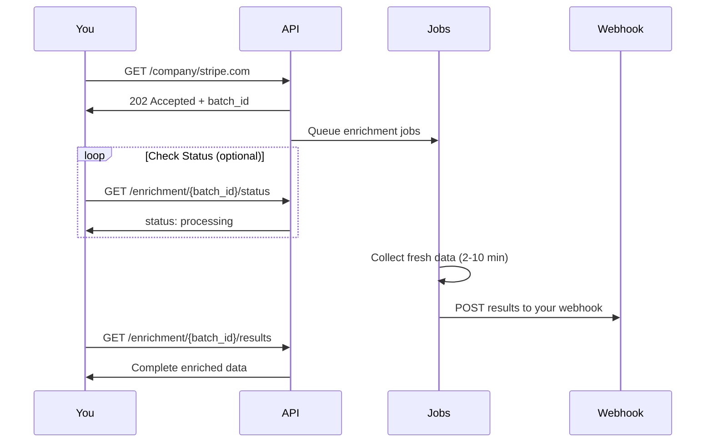

## Overview

When a domain enrichment is triggered, you receive a `batch_id`. Use these endpoints to track progress and retrieve results.

<Info>
  **Recommended:** Configure a [webhook](/webhooks) to receive results automatically. Use these endpoints as a fallback or for status monitoring.
</Info>

## Enrichment Lifecycle



## Check Enrichment Status

Poll this endpoint to track enrichment progress:

```
GET /api/v1/enrichment/{batch_id}/status
```

<CodeGroup>
```bash cURL
curl -X GET "https://api.bouncewatch.com/api/v1/enrichment/batch_1gVwXby8PsYHoMQR/status" \
  -H "X-API-Key: YOUR_API_KEY"
```

```javascript JavaScript
const checkStatus = async (batchId) => {
  const response = await fetch(
    `https://api.bouncewatch.com/api/v1/enrichment/${batchId}/status`,
    { headers: { 'X-API-Key': 'YOUR_API_KEY' } }
  );
  return response.json();
};

// Poll every 30 seconds
const pollStatus = async (batchId) => {
  while (true) {
    const result = await checkStatus(batchId);
    console.log(`Status: ${result.status}`);
    
    if (['completed', 'failed', 'no_data_found'].includes(result.status)) {
      return result;
    }
    await new Promise(r => setTimeout(r, 30000));
  }
};
```

```python Python
import requests
import time

def check_status(batch_id):
    response = requests.get(
        f'https://api.bouncewatch.com/api/v1/enrichment/{batch_id}/status',
        headers={'X-API-Key': 'YOUR_API_KEY'}
    )
    return response.json()

# Poll every 30 seconds
def poll_status(batch_id):
    while True:
        result = check_status(batch_id)
        print(f"Status: {result['status']}")
        
        if result['status'] in ['completed', 'failed', 'no_data_found']:
            return result
        time.sleep(30)
```

```php PHP
function checkStatus($batchId) {
    $ch = curl_init("https://api.bouncewatch.com/api/v1/enrichment/{$batchId}/status");
    curl_setopt($ch, CURLOPT_RETURNTRANSFER, true);
    curl_setopt($ch, CURLOPT_HTTPHEADER, ['X-API-Key: YOUR_API_KEY']);
    $response = curl_exec($ch);
    return json_decode($response, true);
}
```
</CodeGroup>

### Status Response

```json
{
  "success": true,
  "batch_id": "batch_1gVwXby8PsYHoMQR",
  "domain": "stripe.com",
  "status": "processing",
  "requested_modules": ["business", "technology"],
  "message": null,
  "credits": {
    "reserved": 20,
    "used": 0,
    "refunded": 0
  },
  "timing": {
    "requested_at": "2026-02-10T10:00:00Z",
    "started_at": "2026-02-10T10:00:05Z",
    "completed_at": null,
    "duration_seconds": null
  },
  "webhook": {
    "url": "https://your-server.com/webhook",
    "sent_at": null,
    "status": null,
    "retries": 0
  },
  "results_endpoint": null
}
```

<Info>
  `results_endpoint` will be `null` until the enrichment completes. Once status is `completed`, it returns the URL to fetch results.
</Info>

### Status Values

| Status | Description |
|--------|-------------|
| `queued` | Request accepted, waiting to start |
| `processing` | Jobs are actively running |
| `completed` | All jobs finished successfully |
| `failed` | One or more jobs failed |
| `no_data_found` | Domain has no available data |

## Get Enrichment Results

Once status is `completed`, retrieve the full results:

```
GET /api/v1/enrichment/{batch_id}/results
```

<CodeGroup>
```bash cURL
curl -X GET "https://api.bouncewatch.com/api/v1/enrichment/batch_1gVwXby8PsYHoMQR/results" \
  -H "X-API-Key: YOUR_API_KEY"
```

```javascript JavaScript
const getResults = async (batchId) => {
  const response = await fetch(
    `https://api.bouncewatch.com/api/v1/enrichment/${batchId}/results`,
    { headers: { 'X-API-Key': 'YOUR_API_KEY' } }
  );
  return response.json();
};
```

```python Python
def get_results(batch_id):
    response = requests.get(
        f'https://api.bouncewatch.com/api/v1/enrichment/{batch_id}/results',
        headers={'X-API-Key': 'YOUR_API_KEY'}
    )
    return response.json()
```

```php PHP
function getResults($batchId) {
    $ch = curl_init("https://api.bouncewatch.com/api/v1/enrichment/{$batchId}/results");
    curl_setopt($ch, CURLOPT_RETURNTRANSFER, true);
    curl_setopt($ch, CURLOPT_HTTPHEADER, ['X-API-Key: YOUR_API_KEY']);
    $response = curl_exec($ch);
    return json_decode($response, true);
}
```
</CodeGroup>

### Results Response

```json
{
  "success": true,
  "batch_id": "batch_1gVwXby8PsYHoMQR",
  "domain": "stripe.com",
  "status": "completed",
  "data": {
    "company": {
      "name": "Stripe",
      "domain": "stripe.com",
      "description": "Financial infrastructure for the internet",
      "founded_year": 2010,
      "employee_count": 8000
    },
    "funding": {
      "total_funding": 8700000000,
      "funding_stage": "Series I",
      "rounds": [ ... ]
    },
    "team": {
      "total_employees": 8000,
      "hiring_status": "actively_hiring",
      "leadership": [ ... ]
    }
  },
  "credits_used": 26,
  "credits_refunded": 0,
  "credits_breakdown": {
    "base": 10,
    "enrichments": { "funding": 10, "team": 6 }
  },
  "modules_included": ["base", "funding", "team"],
  "completed_at": "2026-02-10T10:05:30Z"
}
```

## Credit Handling

Credits are deducted when the batch is queued, and refunded in full if it produces
nothing:

| Batch outcome | What you pay |
|---------------|--------------|
| `completed` | The full reserved amount |
| `no_data_found` | **Nothing** — fully refunded |
| `failed` | **Nothing** — fully refunded |

<Warning>
  Refunds are all-or-nothing at the batch level. If the batch completes but an individual
  module came back thin, that is still a completed batch and the full amount stands —
  there is no partial refund per module.
</Warning>

<Note>
  The refund lands on your balance before the webhook fires, so the `credits` block in the
  webhook payload already reflects it.
</Note>

## Webhook Notification

When enrichment completes, we POST to your configured webhook:

```json
{
  "event": "enrichment.completed",
  "batch_id": "batch_1gVwXby8PsYHoMQR",
  "domain": "stripe.com",
  "status": "completed",
  "requested_modules": ["business", "technology"],
  "completed_at": "2026-02-10T10:05:30Z",
  "duration_seconds": 330,
  "credits": {
    "reserved": 20,
    "used": 20,
    "refunded": 0
  },
  "data_url": "https://api.bouncewatch.com/api/v1/enrichment/batch_1gVwXby8PsYHoMQR/results"
}
```

<Card title="Configure Webhooks" icon="bell" href="/webhooks">
  Set up your webhook endpoint to receive notifications →
</Card>

## Estimated Processing Times

| Modules Requested | Estimated Time |
|-------------------|----------------|
| Base only | 1-2 minutes |
| 1-2 modules | 3-5 minutes |
| 3-4 modules | 5-8 minutes |
| All modules | 8-12 minutes |

<Tip>
  Processing times depend on data availability. Companies with more online presence are typically faster to enrich.
</Tip>
