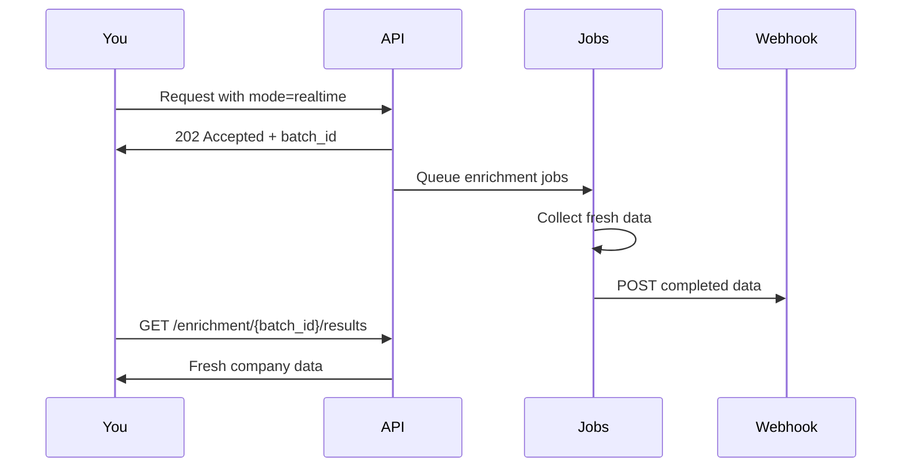

## Overview

The Realtime API fetches fresh data from multiple sources asynchronously. Use this when you need the most up-to-date information.

<Info>
  **How it works:** Request is queued → Background jobs collect data → You're notified via webhook when complete
</Info>

## Workflow



## Initiating Realtime Enrichment

<ParamField query="mode" type="string" required>
  Set to `realtime` to trigger async enrichment
</ParamField>

<ParamField query="enrich" type="string">
  Comma-separated list of enrichment modules
</ParamField>

<CodeGroup>
```bash cURL
curl -X GET "https://api.bouncewatch.com/v1/company/stripe.com?mode=realtime&enrich=business,technology" \
  -H "X-API-Key: YOUR_API_KEY"
```

```javascript JavaScript
const response = await fetch(
  'https://api.bouncewatch.com/v1/company/stripe.com?mode=realtime&enrich=business,technology',
  { headers: { 'X-API-Key': 'YOUR_API_KEY' } }
);
const data = await response.json();
console.log(`Batch ID: ${data.data.batch_id}`);
```

```python Python
response = requests.get(
    'https://api.bouncewatch.com/v1/company/stripe.com',
    headers={'X-API-Key': 'YOUR_API_KEY'},
    params={
        'mode': 'realtime',
        'enrich': 'business,technology'
    }
)
batch_id = response.json()['data']['batch_id']
```

```php PHP
$ch = curl_init('https://api.bouncewatch.com/v1/company/stripe.com?mode=realtime&enrich=business,technology');
curl_setopt($ch, CURLOPT_RETURNTRANSFER, true);
curl_setopt($ch, CURLOPT_HTTPHEADER, ['X-API-Key: YOUR_API_KEY']);
$response = curl_exec($ch);
$data = json_decode($response, true);
$batchId = $data['data']['batch_id'];
```
</CodeGroup>

### Initial Response

```json
{
  "success": true,
  "mode": "realtime",
  "message": "Enrichment process initiated",
  "data": {
    "batch_id": "batch_1gVwXby8PsYHoMQR",
    "domain": "stripe.com",
    "status": "queued",
    "requested_modules": ["business", "technology"],
    "estimated_time_seconds": 300,
    "status_url": "https://api.bouncewatch.com/v1/enrichment/batch_1gVwXby8PsYHoMQR/status",
    "results_url": "https://api.bouncewatch.com/v1/enrichment/batch_1gVwXby8PsYHoMQR/results",
    "webhook_configured": true
  }
}
```

## Checking Status

Poll the status endpoint to track progress:

```
GET /v1/enrichment/{batch_id}/status
```

<CodeGroup>
```bash cURL
curl -X GET "https://api.bouncewatch.com/v1/enrichment/batch_1gVwXby8PsYHoMQR/status" \
  -H "X-API-Key: YOUR_API_KEY"
```

```javascript JavaScript
const checkStatus = async (batchId) => {
  const response = await fetch(
    `https://api.bouncewatch.com/v1/enrichment/${batchId}/status`,
    { headers: { 'X-API-Key': 'YOUR_API_KEY' } }
  );
  return response.json();
};
```

```python Python
def check_status(batch_id):
    response = requests.get(
        f'https://api.bouncewatch.com/v1/enrichment/{batch_id}/status',
        headers={'X-API-Key': 'YOUR_API_KEY'}
    )
    return response.json()
```

```php PHP
function checkStatus($batchId) {
    $ch = curl_init("https://api.bouncewatch.com/v1/enrichment/{$batchId}/status");
    curl_setopt($ch, CURLOPT_RETURNTRANSFER, true);
    curl_setopt($ch, CURLOPT_HTTPHEADER, ['X-API-Key: YOUR_API_KEY']);
    $response = curl_exec($ch);
    return json_decode($response, true);
}
```
</CodeGroup>

### Status Response

```json
{
  "success": true,
  "data": {
    "batch_id": "batch_1gVwXby8PsYHoMQR",
    "domain": "stripe.com",
    "status": "processing",
    "progress": {
      "completed": 3,
      "total": 5,
      "percentage": 60
    },
    "modules": {
      "base": "completed",
      "business": "completed",
      "technology": "processing"
    },
    "started_at": "2025-11-23T10:00:00Z",
    "estimated_completion": "2025-11-23T10:05:00Z"
  }
}
```

### Status Values

| Status | Description |
|--------|-------------|
| `queued` | Request accepted, waiting to start |
| `processing` | Jobs are actively running |
| `completed` | All jobs finished successfully |
| `failed` | One or more jobs failed |
| `partial` | Some modules completed, others failed |

## Getting Results

Once status is `completed`, fetch the results:

```
GET /v1/enrichment/{batch_id}/results
```

<CodeGroup>
```bash cURL
curl -X GET "https://api.bouncewatch.com/v1/enrichment/batch_1gVwXby8PsYHoMQR/results" \
  -H "X-API-Key: YOUR_API_KEY"
```

```javascript JavaScript
const getResults = async (batchId) => {
  const response = await fetch(
    `https://api.bouncewatch.com/v1/enrichment/${batchId}/results`,
    { headers: { 'X-API-Key': 'YOUR_API_KEY' } }
  );
  return response.json();
};
```

```python Python
def get_results(batch_id):
    response = requests.get(
        f'https://api.bouncewatch.com/v1/enrichment/{batch_id}/results',
        headers={'X-API-Key': 'YOUR_API_KEY'}
    )
    return response.json()
```

```php PHP
function getResults($batchId) {
    $ch = curl_init("https://api.bouncewatch.com/v1/enrichment/{$batchId}/results");
    curl_setopt($ch, CURLOPT_RETURNTRANSFER, true);
    curl_setopt($ch, CURLOPT_HTTPHEADER, ['X-API-Key: YOUR_API_KEY']);
    $response = curl_exec($ch);
    return json_decode($response, true);
}
```
</CodeGroup>

### Results Response

```json
{
  "success": true,
  "data": {
    "batch_id": "batch_1gVwXby8PsYHoMQR",
    "domain": "stripe.com",
    "status": "completed",
    "credits": {
      "reserved": 20,
      "used": 20,
      "refunded": 0
    },
    "completed_at": "2025-11-23T10:05:30Z",
    "duration_seconds": 330,
    "company": {
      // Same structure as Cached API response
    },
    "business": {
      // Fresh business data
    },
    "technology": {
      // Fresh technology data
    }
  }
}
```

## Webhook Notification

When enrichment completes, we'll POST to your configured webhook:

```json
{
  "event": "enrichment.completed",
  "batch_id": "batch_1gVwXby8PsYHoMQR",
  "domain": "stripe.com",
  "status": "completed",
  "requested_modules": ["business", "technology"],
  "requested_at": "2025-11-23T10:00:00Z",
  "completed_at": "2025-11-23T10:05:30Z",
  "duration_seconds": 330,
  "credits": {
    "reserved": 20,
    "used": 20,
    "refunded": 0
  },
  "data_url": "https://api.bouncewatch.com/v1/enrichment/batch_1gVwXby8PsYHoMQR/results",
  "_meta": {
    "api_version": "2.0",
    "webhook_attempt": 1
  }
}
```

<Card title="Configure Webhooks" icon="bell" href="/webhooks">
  Set up your webhook endpoint to receive notifications →
</Card>

## Polling Example

If you prefer polling over webhooks:

<Tabs>
  <Tab title="JavaScript">
    ```javascript
    async function getRealtimeData(domain, modules) {
      // 1. Initiate enrichment
      const initResponse = await fetch(
        `https://api.bouncewatch.com/v1/company/${domain}?mode=realtime&enrich=${modules.join(',')}`,
        { headers: { 'X-API-Key': API_KEY } }
      );
      const { data: { batch_id } } = await initResponse.json();
      
      // 2. Poll for completion
      while (true) {
        const statusResponse = await fetch(
          `https://api.bouncewatch.com/v1/enrichment/${batch_id}/status`,
          { headers: { 'X-API-Key': API_KEY } }
        );
        const { data: { status } } = await statusResponse.json();
        
        if (status === 'completed') break;
        if (status === 'failed') throw new Error('Enrichment failed');
        
        await new Promise(r => setTimeout(r, 10000)); // Wait 10s
      }
      
      // 3. Get results
      const resultsResponse = await fetch(
        `https://api.bouncewatch.com/v1/enrichment/${batch_id}/results`,
        { headers: { 'X-API-Key': API_KEY } }
      );
      return resultsResponse.json();
    }
    
    // Usage
    const data = await getRealtimeData('stripe.com', ['funding', 'team']);
    ```
  </Tab>
  
  <Tab title="Python">
    ```python
    import time
    import requests

    def get_realtime_data(domain, modules):
        # 1. Initiate enrichment
        response = requests.get(
            f'https://api.bouncewatch.com/v1/company/{domain}',
            headers={'X-API-Key': API_KEY},
            params={'mode': 'realtime', 'enrich': ','.join(modules)}
        )
        batch_id = response.json()['data']['batch_id']
        
        # 2. Poll for completion
        while True:
            status_response = requests.get(
                f'https://api.bouncewatch.com/v1/enrichment/{batch_id}/status',
                headers={'X-API-Key': API_KEY}
            )
            status = status_response.json()['data']['status']
            
            if status == 'completed':
                break
            if status == 'failed':
                raise Exception('Enrichment failed')
            
            time.sleep(10)  # Wait 10s
        
        # 3. Get results
        results = requests.get(
            f'https://api.bouncewatch.com/v1/enrichment/{batch_id}/results',
            headers={'X-API-Key': API_KEY}
        )
        return results.json()

    # Usage
    data = get_realtime_data('stripe.com', ['funding', 'team'])
    ```
  </Tab>
</Tabs>

## Credit Handling

Credits for realtime enrichment are handled in stages:

| Stage | Action |
|-------|--------|
| **Request** | Credits are **reserved** based on requested modules |
| **Completion** | Reserved credits are **charged** |
| **Failure** | Unused credits are **refunded** |

<Note>
  If a module fails to enrich, you'll only be charged for successfully completed modules.
</Note>

## When to Use Realtime API

<CardGroup cols={2}>
  <Card title="Best For" icon="check" color="#22c55e">
    - Deep due diligence
    - Tracking recent company changes
    - Mission-critical decisions
    - Infrequent, high-value lookups
  </Card>
  <Card title="Consider Cached For" icon="bolt" color="#eab308">
    - High-volume requests
    - Quick lookups
    - Dashboard displays
    - When speed matters more than freshness
  </Card>
</CardGroup>

## Estimated Processing Times

| Modules Requested | Estimated Time |
|-------------------|----------------|
| Base only | 1-2 minutes |
| 1-2 modules | 3-5 minutes |
| 3-4 modules | 5-8 minutes |
| All modules | 8-12 minutes |

<Tip>
  Processing times depend on data availability. Companies with more online presence are typically faster to enrich.
</Tip>
